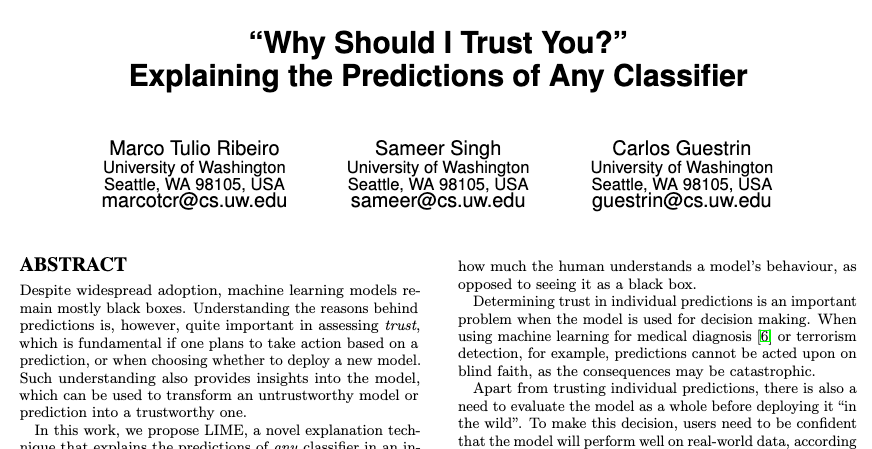

## Data load

```{r setup, include=FALSE}
knitr::opts_chunk$set(cache = TRUE)

set.seed(1297846)

library(tidyverse)

# nifty function for making our table output pretty
output_table <- function(dat) {
  knitr::kable(dat, format = "html") %>% 
  kableExtra::kable_styling(full_width = F)
}
```

.pull-left[
```{r wine_data_load, message=FALSE, warning=FALSE, cache=TRUE}
wine <- "winemag-data-130k-v2.csv" %>% 
  read_csv %>%
  rename(index = X1) %>% 
  mutate(
    variety = variety %>% tolower,
    # missing data filled from description
    variety = ifelse(
      index == 86909, 
      "petite syrah", 
      variety
    ) 
  )
```

```{r wine_vis_dat, eval=FALSE, cache=TRUE}
wine %>% 
    sample_n(30000) %>% 
    visdat::vis_dat()
```
]

.pull-right[
```{r wine_vis_dat_out, ref.label="wine_vis_dat", echo=FALSE, dpi = 300, fig.width = 5, fig.height = 5, out.height = 500, out.width = 500}
```
]

---
## Points

.pull-left[
Wine is rated from 80 to 100 *points*:

```{r wine_plot_colours}
red_wine_colour <- "#59121C"
white_wine_colour <- "#EADB9F"
rosé_wine_colour <- "#F5C0A2"
wine_plot_colours <- c(
  "red" = red_wine_colour, 
  "white" = white_wine_colour,
  "rosé" = rosé_wine_colour
)
```

```{r wine_point_histogram, eval=FALSE}
wine %>% ggplot(aes(x = points)) + 
  geom_histogram(
    bins = nrow(wine %>% distinct(points)),
    colour = white_wine_colour,
    fill = red_wine_colour
  )
```

Thanks to Deanna Neuzerling for the colour scheme!
]

.pull-right[
```{r wine_point_histogram_out, ref.label="wine_point_histogram", echo=FALSE, dpi = 300, fig.width = 5, fig.height = 5, out.height = 500, out.width = 500}
```
]

---
class: inverse
## Wine colours

I like red wine. I don't like white wine.

<center>
</img>
</center>


---
## Wine colours

.pull-left[
Scraping wine colours with R:
[https://mdneuzerling.com/post/scraping-wine-colours-with-r/](https://mdneuzerling.com/post/scraping-wine-colours-with-r/)

```{r joining_with_variety_colours, message=FALSE}
wine <- wine %>% left_join(
  read_csv("variety_colours.csv"),
  by = "variety"
)
```

```{r wine_colours_plot, eval=FALSE}
wine %>% 
  ggplot(aes(x = colour, fill = colour)) + 
  geom_bar() + 
  scale_fill_manual(
    values = wine_plot_colours
  ) + 
  ggtitle("Wine colours") +
  theme(legend.position="none")
```
]

.pull-right[
```{r wine_colours_plot_out, ref.label="wine_colours_plot", echo=FALSE, dpi = 300, fig.width = 5, fig.height = 5, out.height = 500, out.width = 500}
```
]

---
## This is what an 80-point wine is like

A 1998 French red blend:

.pull-left[
```{r grandma_wine, eval=FALSE}
wine %>% 
    filter(index == 11086) %>% 
    select(description) %>% 
    paste0('> ', .) %>% # print as quote
    cat
```
]

.pull-right[
```{r grandma_wine_out, ref.label="grandma_wine", echo=FALSE, results='asis'}
```
]

---
## Tennis balls?

Tennis balls are mentioned in `r wine %>% filter(grepl("tennis ball", description)) %>% nrow` wine reviews. This Californian sauvignon blanc got 88 points:

.pull-left[
```{r tennis_ball_wine, eval=FALSE}
wine %>% 
    filter(index == 12834) %>% 
    select(description) %>% 
    paste0('> ', .) %>% # print as quote
    cat
```
]

.pull-right[
```{r tennis_ball_wine_out, ref.label="tennis_ball_wine", echo=FALSE, results='asis'}
```
]

---
## Word frequency

.pull-left[
```{r wine_words, cache=TRUE}
wine_words <- wine %>% 
  tidytext::unnest_tokens(
    word, 
    description
  ) %>% 
  anti_join(
    tidytext::stop_words, 
    by = "word"
  ) 
```
]

.pull-right[
```{r wine_words_head}
wine_words %>% 
  select(index, word) %>% 
  head %>% 
  output_table
```
]

---
## Word frequency

.pull-left[
```{r wine_1grams_plot, eval=FALSE}
wine_words %>%
  count(word, colour, sort = TRUE) %>%
  head(20) %>%
  mutate(word = reorder(word, n)) %>%
  ggplot(aes(word, n, fill = colour)) +
  geom_col() + 
  scale_fill_manual(
    values = wine_plot_colours
  ) +
  xlab(NULL) +
  theme(text = element_text(size = 16)) +
  coord_flip() +
  ggtitle("Frequency of words") +
  theme(legend.position = "none")
```
]

.pull-right[
```{r wine_1grams_plot_out, ref.label="wine_1grams_plot", echo=FALSE, dpi = 300, fig.width = 5, fig.height = 5, out.height = 500, out.width = 500}
```
]

---
## Word frequency

.pull-left[
I'm not sure what purpose word clouds serve, but they seem compulsory at this point.

```{r word_cloud, eval=FALSE}
wine_words %>%
  count(word) %>%
  with(
    wordcloud::wordcloud(
      word, 
      n, 
      max.words = 100
    )
  )
```
]

.pull-right[
```{r word_cloud_out, ref.label="word_cloud", echo=FALSE, dpi = 300, fig.width = 5, fig.height = 5, out.height = 500, out.width = 500}
```
]

---
## 2-gram frequency

.pull-left[
```{r 2grams, cache=TRUE}
wine_2grams <- wine %>%  
  tidytext::unnest_tokens(
    ngram, 
    description, 
    token = "ngrams", 
    n = 2
  ) %>% 
  separate(
    ngram, 
    c("word1", "word2"), 
    sep = " ", 
    remove = FALSE
  ) %>% 
  filter_at(
    vars(starts_with("word")), 
    all_vars(
      !(. %in% tidytext::stop_words$word)
    )
  )
```
]

.pull-right[
```{r 2grams_head}
wine_2grams %>% 
  select(index, ngram, word1, word2) %>% 
  head %>% 
  output_table
```
]

---
## 2-gram frequency

.pull-left[
```{r wine_2grams_plot, eval=FALSE}
wine_2grams %>%
  count(ngram, colour, sort = TRUE) %>%
  head(20) %>%
  mutate(ngram = reorder(ngram, n)) %>%
  ggplot(aes(ngram, n, fill = colour)) +
  geom_col() +
  scale_fill_manual(
    values = wine_plot_colours
  ) +
  xlab(NULL) +
  coord_flip() + 
  ggtitle("Frequency of 2-grams") +
  theme(legend.position = "none")
```
]

.pull-right[
```{r wine_2grams_plot_out, ref.label="wine_2grams_plot", echo=FALSE, dpi = 300, fig.width = 5, fig.height = 5, out.height = 500, out.width = 500}
```
]

---
## Train and test

We're about to do some modelling. Let's prepare our train and test sets:
```{r wine_split}
wine_split <- rsample::initial_split(wine, p = 0.80)
wine_train <- rsample::training(wine_split)
wine_test <- rsample::testing(wine_split)
```

---
class: inverse
## Vectorising

We'll be loosely following [Shirin Glander's](https://shirinsplayground.netlify.com/2018/07/explaining_ml_models_code_text_lime/) approach to preprocessing here, which identifies the following steps:

1. stem and tokenise
1. generate a vocabulary
1. remove stop words 
1. prune the vocabulary 
1. transform into a vector space 

--

We need a function that maps an **arbitrary string** onto this vector space.

---
## Stem and tokenise

.pull-left[
```{r stem_tokeniser}
stem_tokeniser <- function(x) {
    lapply(
        text2vec::word_tokenizer(x), 
        SnowballC::wordStem, 
        language = "en"
    )
}
```
]

.pull-right[
```{r stem_tokeniser_example_1}
stem_tokeniser(
  "Dreaming sufficient identical usually"
)
```

```{r stem_tokeniser_example_2}
stem_tokeniser(
  "information informed informing informs"
)
```
]

---
## Generate a vocabulary, remove stop words and prune

.pull-left[
```{r vocabulary}
wine_train_tokens <- text2vec::itoken(
  wine_train$description, 
  preprocessor = tolower, 
  tokenizer = stem_tokeniser,
  progressbar = FALSE
)

vocabulary <- text2vec::create_vocabulary(
  wine_train_tokens, 
  stopwords = c(
    tidytext::stop_words$word, 
    "wine", "fruit", "flavour", "flavor"
  )
) %>% 
  text2vec::prune_vocabulary(
    doc_proportion_min = 0.01,
    doc_proportion_max = 0.80
  )
```
]

.pull-right[
```{r vocabulary_out}
vocabulary
```
]

---
class: inverse
## Vectoriser

Our `vectoriser` will take an arbitrary string and map it to these `r length(vocabulary$term)` stemmed terms. 

Any new terms will be **ignored**.

```{r vectoriser}
vectoriser <- vocabulary %>% text2vec::vocab_vectorizer()
```

---
## Document term matrices

* Every column is one of our `r length(vocabulary$term)` terms
* Every row is a wine review
* Values are weighted by *term frequency–inverse document frequency (tf-idf)*

```{r wine_train_dtm}
wine_train_dtm <- text2vec::create_dtm(wine_train_tokens, vectorizer = vectoriser)
tfidf = text2vec::TfIdf$new()
wine_train_dtm = tfidf$fit_transform(wine_train_dtm)
dim(wine_train_dtm)
```

---
## Document term matrices

```{r wine_dtm_example_description, results='asis'}
paste0('> ', wine[1,]$description) %>% cat
```

```{r wine_dtm_example_tail}
tail(as.matrix(wine_train_dtm)[1,], 21)
```

---
## Mapping new data to a DTM

The vocabulary and document frequency is determined **only** by the training set. If we get a new observation, it has to conform.
```{r map_to_dtm}
map_to_dtm <- function(text) {
  tokens <- text2vec::itoken(
    text, 
    preprocess_function = tolower, 
    tokenizer = stem_tokeniser,
    progressbar = FALSE
  )

  dtm <- text2vec::create_dtm(tokens, vectoriser)
  tfidf$transform(dtm) # transform uses the tfidf already fitted
}
```

---
## xgboost

```{r xgboost, cache = TRUE}
xgb <- xgboost::xgb.train(
  list(
    max_depth = 8, 
    eta = 0.05, 
    objective = "reg:linear",
    eval_metric = "rmse"
  ),
  data = xgboost::xgb.DMatrix(
    wine_train_dtm, 
    label = wine_train$points
  ),
  nrounds = 300
)
```

```{r xgboost_performance}
wine_test_preds <- predict(xgb, map_to_dtm(wine_test$description))
caret::postResample(wine_test_preds, wine_test$points)
```

---
## xgboost

.pull-left[
```{r actuals_distribution, echo=FALSE, dpi = 300, fig.width = 5, fig.height = 5, out.height = 500, out.width = 500}
wine_test_actuals_plot <- wine_test %>% ggplot(aes(x = points)) + 
  geom_histogram(
    breaks = seq(80, 100, 1),
    colour = white_wine_colour,
    fill = red_wine_colour
  ) + 
  labs(title = "actuals", x = "points")
wine_test_actuals_plot
```
]

.pull-right[
```{r predicted_distribution, echo=FALSE, dpi = 300, fig.width = 5, fig.height = 5, out.height = 500, out.width = 500}
wine_test_preds_plot <- wine_test %>% ggplot(aes(x = wine_test_preds)) + 
  geom_histogram(
    breaks = seq(80, 100, 1),
    colour = white_wine_colour,
    fill = red_wine_colour
  ) + 
  labs(title = "predicted", x = "points")
wine_test_preds_plot
```
]

---
## xgboost

```{r xgboost_residuals_actuals, dpi = 300, fig.width = 8, fig.height = 3.5, out.height = 350, out.width = 800}
wine_test_residuals <- wine_test_preds - wine_test$points
wine_test %>% 
  ggplot(aes(x = points, y = wine_test_residuals, group = points)) + 
  geom_violin(fill = red_wine_colour) +
  labs(title = "actuals vs. residuals", x = "actuals", y = "residuals") 
```

---
class:center
## Model performance summary

```{r smily_eyes, echo=FALSE, dpi = 300, fig.width = 5, fig.height = 2.5, out.width = 500, out.height = 250}
gridExtra::grid.arrange(
  wine_test_actuals_plot,
  wine_test_preds_plot,
  ncol = 2
)
```

```{r smiley_mouth, ref.label="xgboost_residuals_actuals", echo=FALSE, dpi = 300, fig.width = 5, fig.height = 2.5, out.width = 500, out.height = 250}
```

---
class: inverse
## LIME

.pull-left[
<center>
</img>
</center>
]

.pull-right[

>There once was a package called lime,

>Whose models were simply sublime,

>It gave explanations for their variations,

>one observation at a time.

*lime-rick* by Mara Averick
]

---
## LIME

* Original paper: [https://arxiv.org/abs/1602.04938](https://arxiv.org/abs/1602.04938)
* R package: [https://github.com/thomasp85/lime](https://github.com/thomasp85/lime)
* Python module: [https://github.com/marcotcr/lime](https://github.com/marcotcr/lime)

<center>
</img>
</center>


---
## LIME

LIME doesn't care about non-linear models, it just needs things to be *locally linear*:

<center>
</img>
</center>


---
## LIME

```{r example_image_explanation, dpi = 300, fig.width = 10, fig.height = 4, out.height = 400, out.width = 1000}
# This example requires the magick package
example_image_explanation <- lime::.load_image_example() 
lime::plot_image_explanation(example_image_explanation)
```

## LIME
---
## Permutations

### Wine 78883, 80 points

> "Tastes sour and bone dry, with grapefruit flavors."

Prediction: `r round(predict(xgb, map_to_dtm(filter(wine, index == 78883)$description)), digits = 2)` points

--
> "Tastes sour and bone dry, with ~~grapefruit~~ flavors."

Prediction: `r round(predict(xgb, map_to_dtm("Tastes sour and bone dry, with flavors.")), digits = 2)` points

--
> "Tastes ~~sour~~ and bone dry with grapefruit flavors."

Prediction: `r round(predict(xgb, map_to_dtm("Tastes and bone dry with grapefruit flavors.")), digits = 2)` points

--
> "Tastes ~~sour~~ and bone ~~dry~~, with grapefruit flavors."

Prediction: `r round(predict(xgb, map_to_dtm("Tastes and bone, with grapefruit flavors.")), digits = 2)` points

---
## Permutations

### Wine 84890, 86 points

> "This is certainly dry, as stated, but it doesn't have the texture and stuffing that the best dry Rieslings bring to the show. Simple and straightforward lemon and grapefruit flavors tell the whole story, and those high acids leave a sour impression."

Prediction: `r round(predict(xgb, map_to_dtm(filter(wine, index == 84890)$description)), digits = 2)` points

--
> "This is certainly dry, as stated, but it doesn't have the texture and stuffing that the best dry Rieslings bring to the show. Simple and straightforward lemon and ~~grapefruit~~ flavors tell the whole story, and those high acids leave a sour impression."

Prediction: `r round(predict(xgb, map_to_dtm(gsub("grapefruit", "", filter(wine, index == 84890)$description))), digits = 2)` points

---
## LIME

```{r wine_explainer, cache=TRUE}
wine_explainer <- lime::lime(
  wine$description,
  xgb,
  preprocess = map_to_dtm
)
```

---
## LIME

```{r custom_lime_explanation_plot, include=FALSE}
custom_lime_explanation_plot <- function(
  explanation, wine, explainer = wine_explainer, n_features = 10
) {
  explanation %>% 
    mutate(effect = ifelse(feature_weight >= 0, "positive", "negative")) %>% 
    ggplot(aes(
      x = reorder(feature_value, feature_weight), 
      y = feature_weight,
      fill = effect
    )) +
    geom_bar(stat = "identity") +
    scale_fill_manual(
      values = c(
        "positive" = white_wine_colour, 
        "negative" = red_wine_colour
      )
    ) +
    coord_flip() +
    labs(
      title = paste0(
        wine$variety,
        ", ", wine$country,
        ", ", wine$points, " points"
      ),
      subtitle = paste0(
        "predicted: ", 
        round(min(explanation$model_prediction), 1),
        " points"
      ),
      x = "feature",
      y = ""
    ) +
    theme(legend.position = "none")
}
```

.pull-left[

```{r wine_a_description, results='asis', echo = FALSE}
wine %>% 
  filter(index == 14072) %>% 
  pull(description) %>% 
  paste0("> ", .) %>% 
  cat
```

```{r wine_a_explanation}
sample_wine <- filter(wine, index == 14072)
sample_wine_explanation <- lime::explain(
  sample_wine$description,
  wine_explainer,
  n_features = 10
)
```

```{r wine_a_explanation_plot, eval=FALSE}
custom_lime_explanation_plot(
  sample_wine_explanation, sample_wine 
)
```
]

.pull-right[
```{r wine_a_explanation_plot_out, ref.label="wine_a_explanation_plot", echo=FALSE, dpi = 300, fig.width = 5, fig.height = 5, out.height = 500, out.width = 500}
```
]

---
## LIME

.pull-left[

```{r wine_b_description, results='asis', echo = FALSE}
wine %>% 
  filter(index == 57215) %>% 
  pull(description) %>% 
  paste0("> ", .) %>% 
  cat
```

```{r wine_b_explanation, echo=FALSE}
wine_b <- filter(wine, index == 57215)
wine_b_explanation <- lime::explain(
  wine_b$description,
  wine_explainer,
  n_features = 10
)
```

```{r wine_b_explanation_plot, echo=FALSE, eval=FALSE}
custom_lime_explanation_plot(
  wine_b_explanation, wine_b 
)
```
]

.pull-right[
```{r wine_b_explanation_plot_out, ref.label="wine_b_explanation_plot", echo=FALSE, dpi = 300, fig.width = 5, fig.height = 5, out.height = 500, out.width = 500}
```
]

---
## LIME

.pull-left[

```{r wine_c_description, results='asis', echo = FALSE}
wine %>% 
  filter(index == 111754) %>% 
  pull(description) %>% 
  paste0("> ", .) %>% 
  cat
```

```{r wine_c_explanation, echo=FALSE}
wine_c <- filter(wine, index == 111754)
wine_c_explanation <- lime::explain(
  wine_c$description,
  wine_explainer,
  n_features = 10
)
```

```{r wine_c_explanation_plot, echo=FALSE, eval=FALSE}
custom_lime_explanation_plot(
  wine_c_explanation, wine_c
)
```
]

.pull-right[
```{r wine_c_explanation_plot_out, ref.label="wine_c_explanation_plot", echo=FALSE, dpi = 300, fig.width = 5, fig.height = 5, out.height = 500, out.width = 500}
```
]

---
## LIME

.pull-left[

```{r wine_d_description, results='asis', echo = FALSE}
wine %>% 
  filter(index == 13781) %>% 
  pull(description) %>% 
  paste0("> ", .) %>% 
  cat
```

```{r wine_d_explanation, echo=FALSE}
wine_d <- filter(wine, index == 13781)
wine_d_explanation <- lime::explain(
  wine_d$description,
  wine_explainer,
  n_features = 10
)
```

```{r wine_d_explanation_plot, echo=FALSE, eval=FALSE}
custom_lime_explanation_plot(
  wine_d_explanation, wine_d
)
```
]

.pull-right[
```{r wine_d_explanation_plot_out, ref.label="wine_d_explanation_plot", echo=FALSE, dpi = 300, fig.width = 5, fig.height = 5, out.height = 500, out.width = 500}
```
]

---
## Categorical predictions

The LIME package comes with an interactive shiny application for text explainers. It only works with classification models, so let's make one. We'll set the boundary between a good and a bad wine as the mean of the training set, `r round(mean(wine_train$points), 1)` points.

```{r wine_good_or_bad}
wine_train <- wine_train %>% mutate(
  good_or_bad = ifelse(points > mean(wine_train$points), "good", "bad")
)

wine_test <- wine_test %>% mutate(
  good_or_bad = ifelse(points > mean(wine_train$points), "good", "bad")
)
```

---
## Categorical predictions
```{r xgb_classification}
xgb_classification <- xgboost::xgb.train(
  list(
    max_depth = 8,
    eta = 0.05, 
    objective = "binary:logistic",
    eval_metric = "error"
  ),
  data = xgboost::xgb.DMatrix(
    wine_train_dtm, 
    label = wine_train$good_or_bad == "good"
  ),
  nrounds = 200
)
```


---
## Categorical predictions

.pull-left[
```{r xgb_classification_confusion_matrix}
wine_categorical_preds <- predict(
  xgb_classification, 
  map_to_dtm(wine_test$description)
)

cm <- caret::confusionMatrix(
  as.factor(
    as.numeric(
      wine_test$good_or_bad == "good"
    )
  ),
  as.factor(round(
    wine_categorical_preds, 
    digits = 0
  ))
)
```
]

.pull-right[
```{r xgb_classification_confusion_matrix_table}
cm$table
```

```{r xgb_classification_confusion_matrix_accuracy}
scales::percent(cm$overall[["Accuracy"]])
```
]

---
class: inverse
## Interactive text explanations

```{r eval=FALSE}
wine_classification_explainer <- lime::lime(
  wine$description,
  xgb_classification,
  preprocess = map_to_dtm
)
lime::interactive_text_explanations(wine_classification_explainer)
```

<!-- If you want to export these objects for an independent explainer, try this: -->
<!-- save(vectoriser, file = "vectoriser.rda") -->
<!-- save(tfidf, file = "tfidf.rda") -->
<!-- save(stem_tokeniser, file = "stem_tokeniser.rda") -->
<!-- save(map_to_dtm, file = "map_to_dtm.rda") -->
<!-- save(xgb_classification, file = "xgb_classification.rda") -->
<!-- save(wine_classification_explainer, file = "wine_classification_explainer.rda") -->

